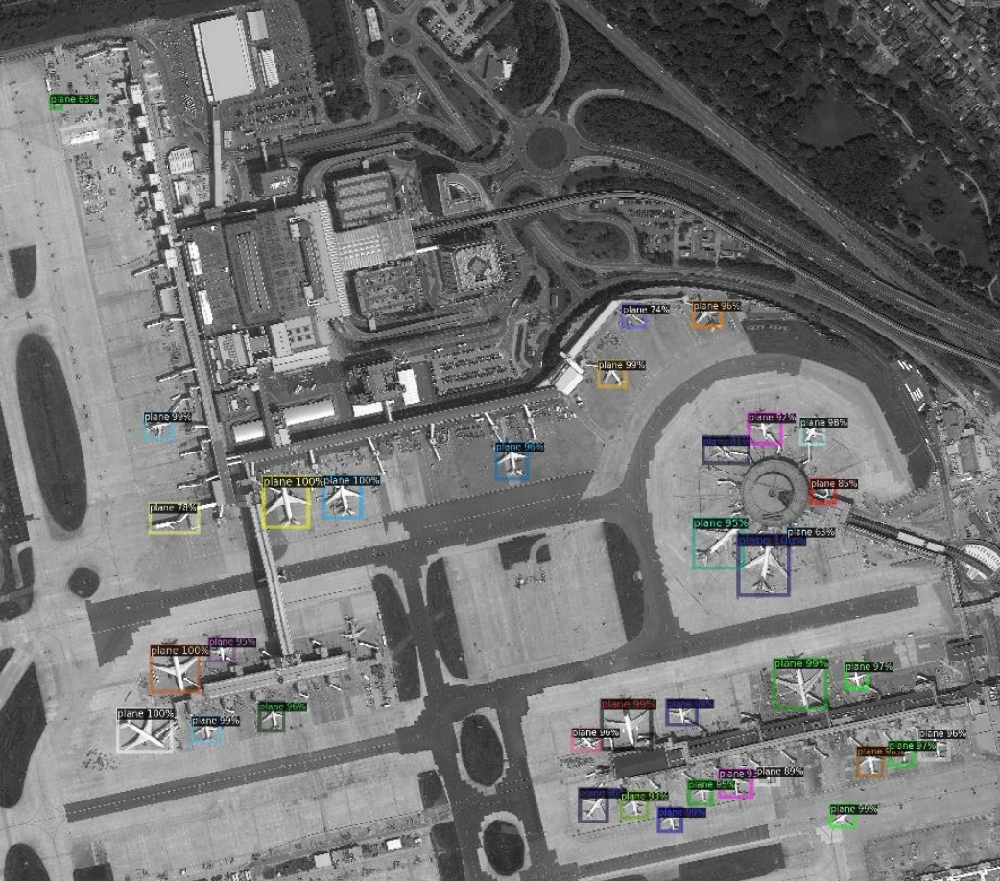

# Plane-Segmentation
This project explores **object detection, semantic segmentation, and instance segmentation** using **Detectron2** and **PyTorch**. The goal is to detect planes in aerial images and generate segmentation masks for each detected plane. The dataset used is a modified version of **iSAID**, which contains high-resolution satellite images.

## Features
- **Object Detection**: Utilized **Faster R-CNN** with **ResNet-101 FPN** to detect planes.
- **Semantic Segmentation**: Implemented a **U-Net-based architecture** to generate segmentation masks.
- **Instance Segmentation**: Combined object detection and segmentation results to create **per-instance masks**.
- **Mask R-CNN**: Compared performance with a **Mask R-CNN model from Detectron2**.

## Dataset
- **Source**: iSAID dataset (custom train/test split)
- **Labels**: Bounding boxes and segmentation masks for planes
- **Preprocessing**: Images cropped into smaller sections for improved detection accuracy

## Model Architectures & Hyperparameters
### Object Detection:
- **Backbone**: ResNet-101 with FPN
- **Pretrained Model**: COCO-Detection Faster R-CNN R101 FPN 3x
- **Hyperparameters**:
  - Learning Rate: **0.003**
  - Batch Size: **2**
  - Max Iterations: **800**
  - ROI Proposals: **512**

### Semantic Segmentation:
- **Architecture**: Custom **U-Net-based** CNN
- **Layers**:
  - **6 downsampling** layers (with batch normalization at key stages)
  - **6 upsampling** layers (with convolutional refinement)
  - **Final output layer** reduces channels to **1** for binary mask prediction.
- **Loss Function**: **Binary Cross-Entropy Loss**
- **Evaluation Metric**: **Mean IoU (0.81 achieved)**

### Instance Segmentation:
- Combined object detection results with segmentation predictions
- Compared performance with **Mask R-CNN**
- **Best Kaggle Score**: **53% Dice Coefficient**

## Results & Performance
- **Object Detection AP@0.50**: ~0.25 (Baseline)
- **Best Mean IoU (Segmentation)**: **0.81**
- **Kaggle Leaderboard Score (Instance Segmentation)**: **53%**
- **Comparison of Methods**:
  - **Custom pipeline (Part 3)**: Higher flexibility and customization
  - **Mask R-CNN (Part 4)**: Faster and more reliable, but slightly lower IoU

## Results

### Object Detection:

### Instance Segmentation:

## Mask R-CNN

## Acknowledgments
This project was developed as part of CMPT412 at SFU.
   
